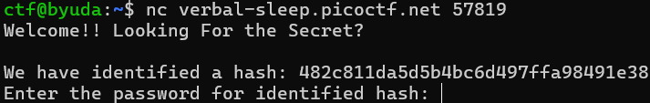
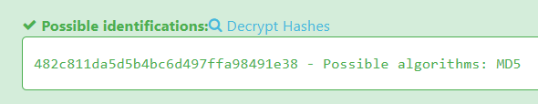
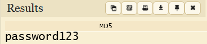
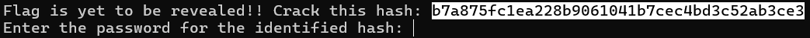
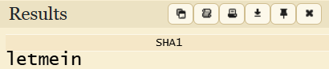
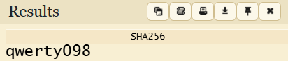
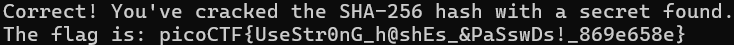

Easy - Cryptography - hashcrack

What i learn : 
Understanding on how long in each of different hashes, 
md5 = 32 characters
md1 = 40 characters
sha256 = 50 characters

Tools : https://hashes.com/en/tools/hash_identifier

1. Given some hashed string and idk what is the type of that

2. With the tools i found that this is md5 hashes

3. Unhash the hashed string with https://www.dcode.fr/md5-hash to get the actual string

4. Given another hashed string, do the previous step and unhash the string with the right online tools

5. If u input the right answer the flag will be printed out
