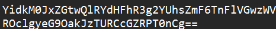
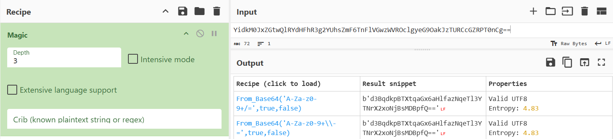
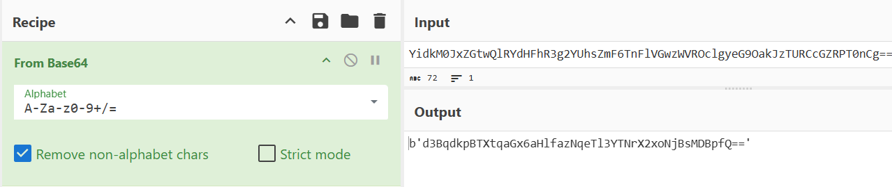
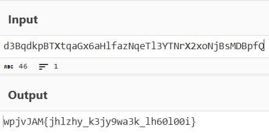
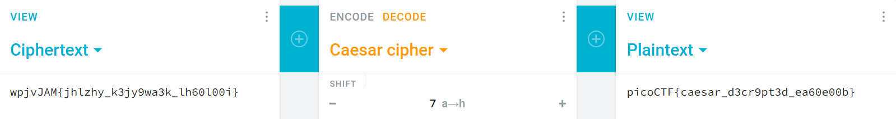

# Easy - Cryptography - interencdec

## What I Learned

- Magic tools from CyberChef to identified any cryptography things
- Nested Base64 Encoding
- Caesar Cipher

## Tools Used
- CyberChef: https://gchq.github.io/CyberChef/
- Caesar Cipher Decryptor: https://cryptii.com/pipes/caesar-cipher

## Step-by-Step Solution

### Step 1: Identify the Encoding Type
Given a string, I needed to determine its type of encoding.

### Step 2: Use CyberChef Magic Tool
Using the CyberChef Magic tool, I found that this is an Base64 Encoding.

### Step 3: Decode
I used an CyberChef "from Base64" recipe to get the actual string. But it stills not readable, so I assume it got encode by multiple times (Nested). So, I decode it again and the output is in different format

### Step 4: Decrypt
By knowing there are curly braces "{}" in the output, then it is likely that this is the flag. But for letter characters, the string is still encrypted. FYI, algorithms that usually cannot handle symbols are classical cryptography algorithms, such as one example is the caesar cipher. By using the tool https://cryptii.com/pipes/caesar-cipher and performing a shift attack (by clicking "+" repeatedly till found the correct answer), the key is found to be 7, along with its flag.

