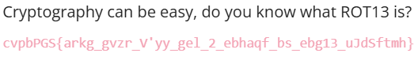
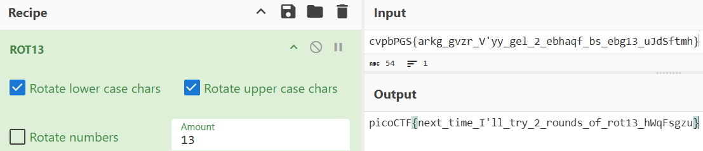

# Easy - Cryptography - mod 26

## What I Learned

- Understanding on ROT13 Decryption
- Decrypting ciphertext with ROT13 Recipe from CyberChef

## Tools Used
- CyberChef: https://gchq.github.io/CyberChef/

## Step-by-Step Solution

### Step 1: Identify
Given a string, and a clue to ROT13 algorithm.

### Step 2: Decrypt
Using the CyberChef ROT13 recipe to decrypt the string. The output comes up to be the flag

